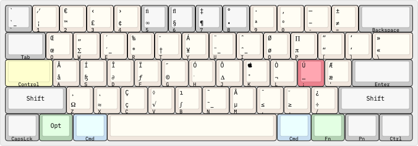

# dotfiles

<a name="keyboard-layers">

## Keyboard Layers

1. [Main Layer](#main)
2. [Control Layer](#control)
3. [Command Layer](#command)
4. [Semicolon Layer](#semicolon) (Arrows, Symbols, Media)
5. [Tab Layer](#tab) (Number Pad, Window Management)
6. [Escape/Quote Layer](#escape) (Function Keys, Numbers, Symbols)
7. [Function Layer](#function) (Mac Function Keys)
8. [Option Layer](#option)

<a name="main">

### Main Layer

```
,------,------,------,------,------,------,------,------,------,------,------,------,------,------------,
| ~    | !    | @    | #    | $    | %    | ^    | &    | *    | (    | )    | _    | +    | Backspace  |
| Esc  | 1    | 2    | 3    | 4    | 5    | 6    | 7    | 8    | 9    | 0    | -    | =    |            |
|------'---,--'---,--'---,--'---,--'---,--'---,--'---,--'---,--'---,--'---,--'---,--'---,--'---,--------|
| Tab      | q    | w    | e    | r    | t    | y    | u    | i    | o    | p    | {    | }    | |      |
|          |      |      |      |      |      |      |      |      |      |      | [    | ]    | \      |
|----------'-,----'-,----'-,----'-,----'-,----'-,----'-,----'-,----'-,----'-,----'-,----'-,----'--------|
| Control    | a    | s    | d    | f    | g    | h    | j    | k    | l    | :    | "    | Enter       |
|            |      |      |      |      |      |      |      |      |      | ;    | '    |             |
|------------'--,---'--,---'--,---'--,---'--,---'--,---'--,---'--,---'--,---'--,---'--,---'-------------|
| Shift         | z    | x    | c    | v    | b    | n    | m    | <    | >    | ?    | Shift           |  
|               |      |      |      |      |      |      |      | ,    | .    | /    |                 |
|--------,------'-,----'---,--'------'------'------'------'------'--,---'----,-'------'-----------------|
|CapsLock| Opt    | Cmd    |                                        | Cmd    | Fn     | Pn     | Ctrl   |
|        |        |        |                                        |        |        |        |        |
'--------'--------'--------'----------------------------------------'--------'--------'--------'--------'
```

<a name="control">

### Control Layer

Bash keyboard shortcuts like [these](https://ss64.com/bash/syntax-keyboard.html).

```
,------,------,------,------,------,------,------,------,------,------,------,------,------,------------,
|      |      |      |      |      |      |      |      |      |      |      |      |      |            |
|      |      |      |      |      |      |      |      |      |      |      |      |      |            |
|------'---,--'---,--'---,--'---,--'---,--'---,--'---,--'---,--'---,--'---,--'---,--'---,--'---,--------|
|          |      | Bksp | End  |      |      |      |      | Tab  |      |Up    |      |      |        |
|          |      | Word |      |      |      |      |      |      |      |Arrow |      |      |        |
|----------'-,----'-,----'-,----'-,----'-,----'-,----'-,----'-,----'-,----'-,----'-,----'-,----'--------|
| ########## | Home |      | Del  |Right |      | Bksp | Enter|      |      |      |      |             |
| ########## |      |      |      |Arrow |      |      |      |      |      |      |      |             |
|------------'--,---'--,---'--,---'--,---'--,---'--,---'--,---'--,---'--,---'--,---'--,---'-------------|
|               |      |      |      |      |Left  |Down  |      |      |      |      |                 |  
|               |      |      |      |      |Arrow |Arrow |      |      |      |      |                 |
|--------,------'-,----'---,--'------'------'------'------'------'--,---'----,-'------'-----------------|
|        |        |        |                                        |        |        |        |        |
|        |        |        |                                        |        |        |        |        |
'--------'--------'--------'----------------------------------------'--------'--------'--------'--------'
```

<a name="command">

### Command Layer

Bash keyboard shortcuts like
[these](https://ss64.com/bash/syntax-keyboard.html). The "Command" maps
that are lost are remapped in the Semicolon and Tab Layers.

```
,------,------,------,------,------,------,------,------,------,------,------,------,------,------------,
|      |      |      |      |      |      |      |      |      |      |      |      |      |            |
|      |      |      |      |      |      |      |      |      |      |      |      |      |            |
|------'---,--'---,--'---,--'---,--'---,--'---,--'---,--'---,--'---,--'---,--'---,--'---,--'---,--------|
|          |      |      |      |      |      |      |      |      |      |      |      |      |        |
|          |      |      |      |      |      |      |      |      |      |      |      |      |        |
|----------'-,----'-,----'-,----'-,----'-,----'-,----'-,----'-,----'-,----'-,----'-,----'-,----'--------|
|            |      |      | Del  |Right |      |      |      |      |      |      |      |             |
|            |      |      | Word |Word  |      |      |      |      |      |      |      |             |
|------------'--,---'--,---'--,---'--,---'--,---'--,---'--,---'--,---'--,---'--,---'--,---'-------------|
|               |      |      |      |      | Left |      |      |      |      |      |                 |  
|               |      |      |      |      | Word |      |      |      |      |      |                 |
|--------,------'-,----'---,--'------'------'------'------'------'--,---'----,-'------'-----------------|
|        |        | ###### |                                        | ###### |        |        |        |
|        |        | ###### |                                        | ###### |        |        |        |
'--------'--------'--------'----------------------------------------'--------'--------'--------'--------'
```

<a name="semicolon">

### Semicolon Layer

Arrow keys and navigation cluster, shifted number row, and media keys. In
Finder.app, `;-u` and `;-o` actually send `Cmd-Up` and `Cmd-Dn`, to navigate up
and down the directory tree.

```
,------,------,------,------,------,------,------,------,------,------,------,------,------,------------,
| `    |      |      |      |      |      |      |      |Volume|Volume|Volume|Volume|Volume|            |
|      |      |      |      |      |      |      |      |Down  |Up    |Mute  |Down  |Up    |            |
|------'---,--'---,--'---,--'---,--'---,--'---,--'---,--'---,--'---,--'---,--'---,--'---,--'---,--------|
| ~        | !    | @    | #    | $    | %    | Del  | Home | PgUp | End  |Play/ | F14  | F15  |        |
|          |      |      |      |      |      |      |      |      |      |Pause |      |      |        |
|----------'-,----'-,----'-,----'-,----'-,----'-,----'-,----'-,----'-,----'-,----'-,----'-,----'--------|
|            | ^    | &    | *    | (    | )    |Left  |Down  |Up    |Right | #### |      |             |
|            |      |      |      |      |      |Arrow |Arrow |Arrow |Arrow | #### |      |             |
|------------'--,---'--,---'--,---'--,---'--,---'--,---'--,---'--,---'--,---'--,---'--,---'-------------|
|               |      | +    | -    | _    | =    | PgDn | Enter|Prev  |Next  |      |                 |  
|               |      |      |      |      |      |      |      |Track |Track |      |                 |
|--------,------'-,----'---,--'------'------'------'------'------'--,---'----,-'------'-----------------|
|        |        |        |                Play/Pause              |        |        |        |        |
|        |        |        |                                        |        |        |        |        |
'--------'--------'--------'----------------------------------------'--------'--------'--------'--------'
```

<a name="tab">

### Tab Layer

Number pad, window management with [Spectacle](https://www.spectacleapp.com/) and the
"Command" commands that were lost in the Command Layer.

```
,------,------,------,------,------,------,------,------,------,------,------,------,------,------------,
| Win  | Win  | Win  | Win  | Win  | Win  | Win  |      | *    | (    | )    | -    | +    |            |
| Next | Full |Center| Left |Right | Top  |Bottom|      |      |      |      |      |      |            |
|------'---,--'---,--'---,--'---,--'---,--'---,--'---,--'---,--'---,--'---,--'---,--'---,--'---,--------|
| ######## |Space |Space |      |      |      |      | 7    | 8    | 9    | /    | *    | :    |        |
| ######## |Left  |Right |      |      |      |      |      |      |      |      |      |      |        |
|----------'-,----'-,----'-,----'-,----'-,----'-,----'-,----'-,----'-,----'-,----'-,----'-,----'--------|
|            |      |      |Cmd+d |Cmd+f |Cmd+g | Bksp | 4    | 5    | 6    | -    | +    | Enter       |
|            |      |      |      |      |      |      |      |      |      |      |      |             |
|------------'--,---'--,---'--,---'--,---'--,---'--,---'--,---'--,---'--,---'--,---'--,---'-------------|
|               |      |      |Space |Space |Cmd+b | 1    | .    | 2    | 3    | =    |                 |  
|               |      |      |Left  |Right |      |      |      |      |      |      |                 |
|--------,------'-,----'---,--'------'------'------'------'------'--,---'----,-'------'-----------------|
|        |        |        |                     0                  |        |        |        |        |
|        |        |        |                                        |        |        |        |        |
'--------'--------'--------'----------------------------------------'--------'--------'--------'--------'
```

<a name="escape">

### Escape/Quote Layer

Function keys, number row and shifted number row. This layer can be triggered using either `Esc` or `'`.

```
,------,------,------,------,------,------,------,------,------,------,------,------,------,------------,
| #### | F1   | F2   | F3   | F4   | F5   | F6   | F7   | F8   | F9   | F10  | F11  | F12  |            |
| #### |      |      |      |      |      |      |      |      |      |      |      |      |            |
|------'---,--'---,--'---,--'---,--'---,--'---,--'---,--'---,--'---,--'---,--'---,--'---,--'---,--------|
|          | 1    | 2    | 3    | 4    | 5    | 6    | 7    | 8    | 9    | 0    |      |      |        |
|          |      |      |      |      |      |      |      |      |      |      |      |      |        |
|----------'-,----'-,----'-,----'-,----'-,----'-,----'-,----'-,----'-,----'-,----'-,----'-,----'--------|
|            | 6    | 7    | 8    | 9    | 0    | Bksp | 4    | 5    | 6    | -    | #### |             |
|            |      |      |      |      |      |      |      |      |      |      | #### |             |
|------------'--,---'--,---'--,---'--,---'--,---'--,---'--,---'--,---'--,---'--,---'--,---'-------------|
|               |      | +    | -    | _    | =    | 1    | .    | 2    | 3    |      |                 |  
|               |      |      |      |      |      |      |      |      |      |      |                 |
|--------,------'-,----'---,--'------'------'------'------'------'--,---'----,-'------'-----------------|
|        |        |        |                     0                  |        |        |        |        |
|        |        |        |                                        |        |        |        |        |
'--------'--------'--------'----------------------------------------'--------'--------'--------'--------'
```

<a name="function">

### Function Layer

Mac function keys.

```
,------,------,------,------,------,------,------,------,------,------,------,------,------,------------,
|      |      |      |      |      |      |      |      |      |      |Volume|Volume|Volume|            |
|      |      |      |      |      |      |      |      |      |      |Mute  |Down  |Up    |            |
|------'---,--'---,--'---,--'---,--'---,--'---,--'---,--'---,--'---,--'---,--'---,--'---,--'---,--------|
|          |      |      |      |      |      |      |      |      |      |Play/ |Bright|Bright|        |
|          |      |      |      |      |      |      |      |      |      |Pause |Down  |Up    |        |
|----------'-,----'-,----'-,----'-,----'-,----'-,----'-,----'-,----'-,----'-,----'-,----'-,----'--------|
|            |      |      |      |      |      |      |      |      |      |Rewind|Fast- |             |
|            |      |      |      |      |      |      |      |      |      |      |Fwd   |             |
|------------'--,---'--,---'--,---'--,---'--,---'--,---'--,---'--,---'--,---'--,---'--,---'-------------|
|               |      |      |      |      |      |      |      |      |      |      |                 |  
|               |      |      |      |      |      |      |      |      |      |      |                 |
|--------,------'-,----'---,--'------'------'------'------'------'--,---'----,-'------'-----------------|
|        |        |        |                                        |        | ###### |        |        |
|        |        |        |                                        |        | ###### |        |        |
'--------'--------'--------'----------------------------------------'--------'--------'--------'--------'
```

<a name="option">

### Option Layer

This is just a reference for what option- and shift-option- do on a Mac.



```
,------,------,------,------,------,------,------,------,------,------,------,------,------,------------,
|      |      |      |      |      |      |      |      |      |      |      |      |      |            |
|      |      |      |      |      |      |      |      |      |      |      |      |      |            |
|------'---,--'---,--'---,--'---,--'---,--'---,--'---,--'---,--'---,--'---,--'---,--'---,--'---,--------|
|          |      |      |      |      |      |      |      |      |      |      |      |      |        |
|          |      |      |      |      |      |      |      |      |      |      |      |      |        |
|----------'-,----'-,----'-,----'-,----'-,----'-,----'-,----'-,----'-,----'-,----'-,----'-,----'--------|
|            |      |      |      |      |      |      |      |      |      |      |      |             |
|            |      |      |      |      |      |      |      |      |      |      |      |             |
|------------'--,---'--,---'--,---'--,---'--,---'--,---'--,---'--,---'--,---'--,---'--,---'-------------|
|               |      |      |      |      |      |      |      |      |      |      |                 |  
|               |      |      |      |      |      |      |      |      |      |      |                 |
|--------,------'-,----'---,--'------'------'------'------'------'--,---'----,-'------'-----------------|
|        |        |        |                                        |        |        |        |        |
|        |        |        |                                        |        |        |        |        |
'--------'--------'--------'----------------------------------------'--------'--------'--------'--------'
```
