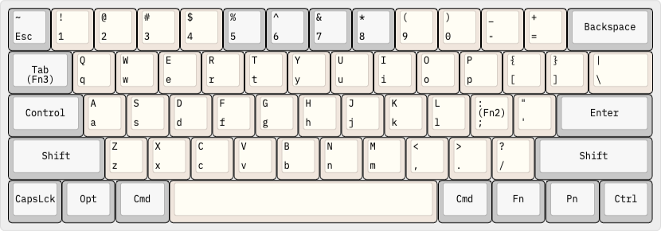
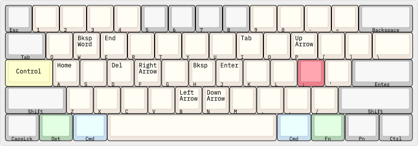
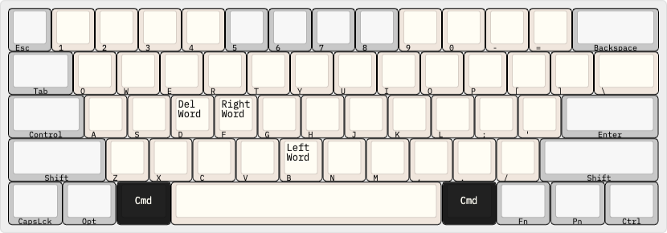
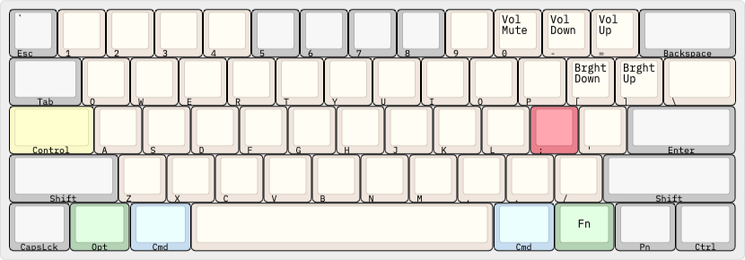
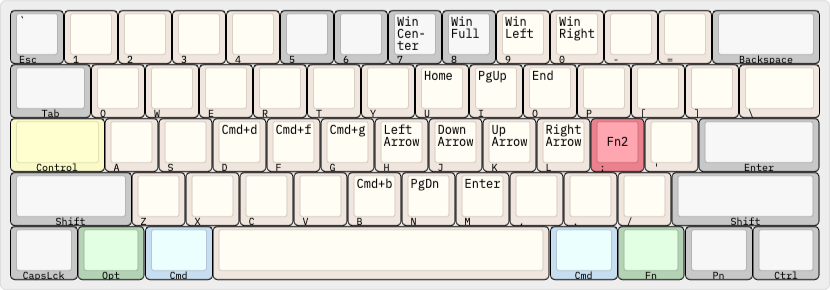
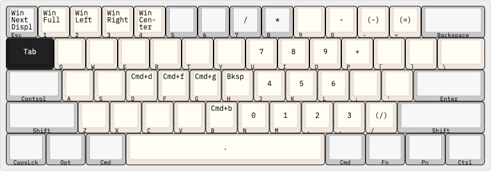

# dotfiles

## Keyboard Layers

### Main Layer

### Control Layer

Made to be like terminal cursor navigation, and enforced pretty much
system-wide.

### Command Layer

Same as the control layer. The "Command" commands that are lost are remapped in
the Semicolon and Tab Layers.

### Function Layer

Volume and media keys.

### Semicolon Layer (Fn2)

Arrow keys and navigation cluster. Also the "Command" commands that were lost
to the Command Layer.

### Tab Layer (Fn3)

Number pad and window management (with
[Spectacle](https://www.spectacleapp.com/)). Also the "Command" commands that
were lost to the Command Layer.

### Option Layer

This is just a reference for what option- and shift-option- do on a Mac.

